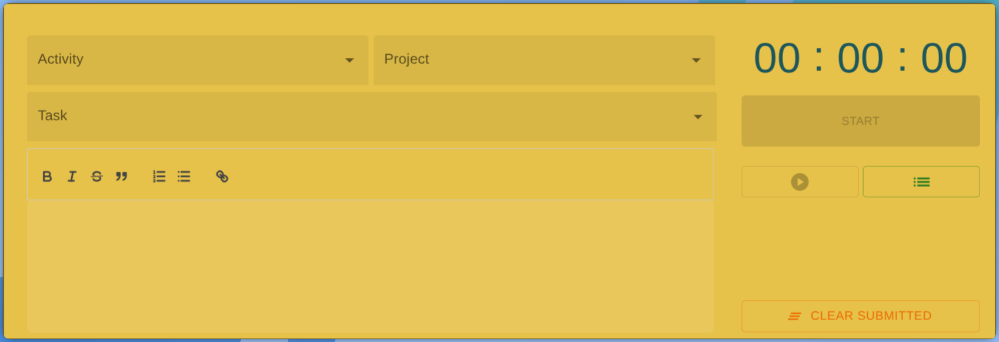
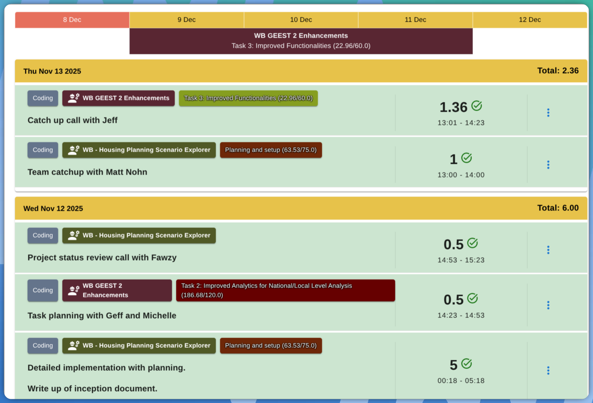
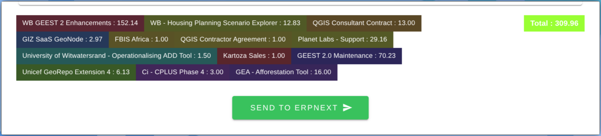

# Go Timesheets Go

<div align="center">


**A beautiful terminal-based timesheet application built with Go and Bubbletea**


</div>

## ✨ Features

- 🚀 **Beautiful TUI** - Terminal user interface with responsive design
- 🖱️ **Full Mouse Support** - Click to interact with all screens and controls
- ⏱️ **Time Tracking** - Start and stop time tracking for projects and activities
- 📊 **Project Management** - Create and manage projects with tasks
- 🖥️ **CLI Commands** - Command-line interface for automation
- 📱 **Waybar Integration** - Desktop status bar integration with JSON output
- 💾 **Data Persistence** - Local JSON-based storage with API sync
- 🎯 **Activity Types** - Categorize work with activities (Coding, Planning, etc.)
- 🎬 **Proof of Work (POW)** - Screenshot timelapse recording during work sessions
- ⭐ **Favourites** - Quick-start timers with preset project/task/activity combinations
- 🎉 **Celebration Mode** - Fireworks celebration after timesheet submission!

## 🚀 Quick Start

### Installation

#### Download Pre-built Binaries

Download the latest release for your platform from [GitHub Releases](https://github.com/kartoza/go-timesheets-go/releases):

- **Linux**: `kartoza-timesheet-linux-amd64.tar.gz` or `kartoza-timesheet-linux-arm64.tar.gz`
- **macOS Intel**: `kartoza-timesheet-darwin-amd64.tar.gz`
- **macOS Apple Silicon**: `kartoza-timesheet-darwin-arm64.tar.gz`
- **Windows**: `kartoza-timesheet-windows-amd64.tar.gz`

```bash
# Download and extract (Linux/macOS example)
tar -xzf kartoza-timesheet-linux-amd64.tar.gz
chmod +x kartoza-timesheet-linux-amd64
sudo mv kartoza-timesheet-linux-amd64 /usr/local/bin/kartoza-timesheet
```

#### Using Nix Flakes (Recommended)

##### Quick Start

```bash
# Try it without installing
nix run github:kartoza/go-timesheets-go

# Install to your profile
nix profile install github:kartoza/go-timesheets-go
```

##### Adding to Your System Configuration

Add the flake as an input to your NixOS or home-manager configuration:

```nix
{
  inputs = {
    nixpkgs.url = "github:NixOS/nixpkgs/nixos-unstable";
    kartoza-timesheet.url = "github:kartoza/go-timesheets-go";
  };

  outputs = { self, nixpkgs, kartoza-timesheet, ... }@inputs: {
    # For NixOS system configuration
    nixosConfigurations.your-hostname = nixpkgs.lib.nixosSystem {
      system = "x86_64-linux";  # or "aarch64-linux" for ARM
      modules = [
        {
          environment.systemPackages = [
            kartoza-timesheet.packages.x86_64-linux.default
          ];
        }
      ];
    };

    # For home-manager configuration
    homeConfigurations.your-username = inputs.home-manager.lib.homeManagerConfiguration {
      pkgs = import nixpkgs { system = "x86_64-linux"; };
      modules = [
        {
          home.packages = [
            kartoza-timesheet.packages.x86_64-linux.default
          ];
        }
      ];
    };
  };
}
```

The package includes a `.desktop` file (on Linux) that will be automatically installed, allowing you to launch the application from your application menu.

#### Traditional Installation

```bash
# Clone the repository
git clone https://github.com/kartoza/go-timesheets-go.git
cd go-timesheets-go

# Build the application
make build
# Or: go build -o kartoza-timesheet .

# Install to system (optional)
sudo make install
# Or: sudo cp kartoza-timesheet /usr/local/bin/
```

### Usage

```bash
# Launch interactive TUI
kartoza-timesheet

# Start time tracking
kartoza-timesheet start "Project Name" "Activity"

# Start with task
kartoza-timesheet start "WB GEEST 2" "Coding" "Task 3: Improved Functionalities"

# Stop tracking
kartoza-timesheet stop

# Get status (for waybar/desktop integration)
kartoza-timesheet status

# Launch fireworks celebration
kartoza-timesheet celebration
kartoza-timesheet celebration --duration 30  # 30 seconds
kartoza-timesheet celebration --duration 0   # Unlimited (press any key to exit)
```

## 🎬 Proof of Work (POW) Mode

POW mode captures screenshots during your work sessions and creates timelapse videos to document your work progress.

### Enabling POW Mode

1. **In the TUI**: Press `p` to toggle POW mode on/off from the main menu
2. **Via command line**: Add the `--pow` flag when running the application

### How POW Works

- When POW mode is enabled and you start a timer, screenshots are captured at regular intervals
- When you stop the timer, a timelapse video is automatically generated from the screenshots
- The video is linked to your timesheet entry and can be viewed from the History view

### Viewing POW Videos

1. Go to **View Timesheet History** from the main menu
2. Entries with POW videos are marked with a 🎬 icon in the status column
3. Select an entry and press **Enter** to view details
4. If a POW video exists for that entry, it will be displayed under "Proof of Work"
5. Press **p** to play the POW video in your system video player

### Managing POW Videos

```bash
# List all POW videos
kartoza-timesheet list-pow

# Play a specific POW video
kartoza-timesheet play-pow
```

### Requirements for POW

- A screenshot tool (`grim`, `scrot`, or `import` from ImageMagick)
- `ffmpeg` for video generation

## ⭐ Favourites

The Favourites feature provides a 3x3 grid of quick-start buttons displayed directly on the main menu, below the active timer and daily progress boxes. This allows instant access to your most commonly used project/task/activity combinations.

### Using Favourites

1. The favourites grid is shown on the **main menu** below the dashboard
2. Press number keys **1-9** to instantly start a timer for that slot
3. Click on any slot to start the timer

### Key Features

- **Quick Start**: One-click or one-key timer starting with preset configurations
- **Main Menu Integration**: Favourites are always visible on the main menu for quick access
- **Auto-stop Previous Timer**: When starting a new timer, any running timer is automatically stopped
- **Git Commit Auto-fill**: If the previous task has a linked git repository, the description is automatically filled with commit messages from the work session
- **Running Indicator**: Currently running favourite slots are highlighted in green with a ▶ indicator

### Configuring Favourites

1. From the main menu, select **Edit Favourites**
2. Press **e** to enter edit mode
3. Select a slot and press **Enter** to configure
4. Set a name for the favourite (optional)
5. Select a project, task (optional), and activity
6. Press **Ctrl+S** or complete the selection to save

### Keyboard Shortcuts

| Key | Action |
|-----|--------|
| `1-9` | Quick start timer from main menu |
| `↑/↓/←/→` | Navigate grid (in Edit Favourites screen) |
| `Enter` | Start timer or Edit slot (in edit mode) |
| `e` | Toggle edit mode |
| `p` | Toggle POW (Proof of Work) mode |
| `Esc/q` | Back to main menu |

## 🖱️ Mouse Support

The application supports full mouse interaction on all screens:

| Screen | Mouse Actions |
|--------|--------------|
| **Main Menu** | Click menu items to select, click favourites grid to start timers |
| **History View** | Click entries to view details |
| **Workspace Associations** | Click Name to edit, Edit to configure, Clear to remove |
| **Code Repos** | Click rows to edit repository associations |
| **Timesheet Creator** | Click fields to focus, click popovers to select, edit date/start time/end time, click Submit |
| **Login Screen** | Click input fields to focus |
| **Edit Favourites** | Click slots to configure in edit mode |

Mouse support works alongside keyboard navigation - use whichever input method you prefer!

## 🎉 Celebration Mode

After submitting timesheets, enjoy a colorful fireworks celebration! You can also launch it directly:

```bash
# Default 60-second celebration
kartoza-timesheet celebration

# Custom duration
kartoza-timesheet celebration -t 30

# Unlimited (press any key to exit)
kartoza-timesheet celebration -t 0
```

The fireworks display uses Kartoza brand colors (reds, oranges, and golds) and syncs to audio if available.

## 🖥️ Desktop Integration

### Waybar Configuration

Add to your waybar config:

```json
{
    "custom/timesheet": {
        "exec": "kartoza-timesheet status",
        "return-type": "json",
        "interval": 5,
        "on-click": "alacritty -e kartoza-timesheet"
    }
}
```

### Status Output

```json
{
    "text": "🔴 01:23:45",
    "alt": "recording",
    "tooltip": "Recording: WB GEEST 2\nActivity: Coding\nSession: 01:23:45\nToday: 6.5h",
    "class": "recording"
}
```

## 📊 Monitoring and Metrics

The application includes built-in monitoring with expvar metrics and request logging.

### Automatic Monitoring Server

When you run the application, a monitoring server automatically starts on `http://localhost:6060`:

```bash
# Start the application - monitoring server starts automatically
kartoza-timesheet

# In another terminal, view metrics in your browser
xdg-open http://localhost:6060
```

The monitoring server exposes:
- `/` - Monitoring dashboard with links and usage instructions
- `/debug/vars` - Raw JSON metrics (expvar format)
- `/health` - Health check endpoint

### API Request Logs

All API requests are logged to daily log files:

```
~/.config/kartoza-timesheets/logs/api-requests-YYYY-MM-DD.log
```

### Using the Monitor Command

```bash
# View today's API request logs
kartoza-timesheet monitor

# Follow logs in real-time (like tail -f)
kartoza-timesheet monitor --follow

# Show logs from the last hour
kartoza-timesheet monitor --since 1h

# Filter logs by endpoint path
kartoza-timesheet monitor --path /api/project
```

### Using expvarmon for Real-Time Monitoring

```bash
# Using Make
make monitor

# Using Nix
nix develop
expvarmon -ports="localhost:6060" \
  -vars="api.requests.total,api.requests.errors,api.requests.inflight,api.cache_hit_ratio" \
  -i 1s
```

## 📱 Screenshots

<div align="center">

### Time Entry Interface


### Daily Listing View


### Submission Workflow


</div>

## 🏗️ Project Structure

```
go-timesheets-go/
├── cmd/                    # CLI command definitions
│   ├── root.go            # Main TUI entry point
│   ├── start.go           # Start timer command
│   ├── stop.go            # Stop timer command
│   ├── status.go          # Status/waybar command
│   ├── celebration.go     # Fireworks celebration command
│   └── monitor.go         # Log monitoring command
├── internal/
│   ├── api/               # API client for timesheet server
│   ├── config/            # Configuration management
│   ├── models/            # Data models and structures
│   ├── monitoring/        # Metrics and logging
│   ├── service/           # Business logic layer
│   ├── storage/           # Data persistence and caching
│   └── tui/               # Terminal user interface
├── scripts/               # Utility scripts
├── flake.nix             # Nix flake for reproducible builds
├── Makefile              # Build automation
└── main.go               # Application entry point
```

## 🔧 Development

### Requirements

- **Go 1.21+** - For traditional Go development
- **Nix with flakes** - For reproducible builds (recommended)
- **Terminal with color support** - For the TUI interface
- **Git** - For version control

### Quick Start for Developers

#### Using Nix (Recommended)

```bash
git clone https://github.com/kartoza/go-timesheets-go.git
cd go-timesheets-go

# Enter development shell with all tools
nix develop

# Build and run
make build
./kartoza-timesheet
```

#### Using Make

```bash
git clone https://github.com/kartoza/go-timesheets-go.git
cd go-timesheets-go

# Install dependencies
make deps

# Build
make build

# Run
./kartoza-timesheet
```

### Makefile Targets

```bash
make build          # Build dynamic binary
make static         # Build static binary
make build-all      # Build both dynamic and static binaries
make clean          # Clean build artifacts
make test           # Run tests
make deps           # Install dependencies
make fmt            # Format code
make lint           # Lint code
make check          # Run all quality checks (fmt, lint, test)
make install        # Install static binary to /usr/local/bin
make uninstall      # Remove binary from /usr/local/bin
make dev            # Start development TUI
make monitor        # Monitor app metrics with expvarmon TUI
make logs           # View API request logs from last hour
make logs-follow    # Follow API request logs in real-time
make release        # Build release binaries for all platforms
make release-upload # Build and upload release to GitHub (requires TAG=vX.Y)
make release-clean  # Clean release artifacts
make help           # Show all available targets
```

## 📦 Release Process

### Building Release Binaries

#### Using Make

```bash
# Build all platform binaries
make release

# Output in release/ directory:
# - kartoza-timesheet-linux-amd64.tar.gz
# - kartoza-timesheet-linux-arm64.tar.gz
# - kartoza-timesheet-darwin-amd64.tar.gz
# - kartoza-timesheet-darwin-arm64.tar.gz
# - kartoza-timesheet-windows-amd64.tar.gz

# Build and upload to GitHub
make release-upload TAG=v0.3
```

#### Using Nix

```bash
# Build all platform binaries
nix run .#release

# Build and upload to GitHub
nix run .#release-upload -- v0.3

# Or build individual platforms with nix build
nix build .#linux-amd64
nix build .#linux-arm64
nix build .#darwin-amd64
nix build .#darwin-arm64
nix build .#windows-amd64

# Build all at once
nix build .#all-releases
```

### Creating a New Release

```bash
# 1. Update version in flake.nix
vim flake.nix  # Change: version = "0.2.0" to version = "0.3.0"

# 2. Commit and push
git add flake.nix
git commit -m "Bump version to 0.3.0"
git push

# 3. Create and push tag
git tag v0.3.0
git push origin v0.3.0

# 4. Build and upload release
make release-upload TAG=v0.3.0
# Or: nix run .#release-upload -- v0.3.0
```

### Supported Platforms

| Platform | Architecture | Binary Name |
|----------|-------------|-------------|
| Linux | AMD64 (x86_64) | `kartoza-timesheet-linux-amd64` |
| Linux | ARM64 (aarch64) | `kartoza-timesheet-linux-arm64` |
| macOS | Intel (AMD64) | `kartoza-timesheet-darwin-amd64` |
| macOS | Apple Silicon (ARM64) | `kartoza-timesheet-darwin-arm64` |
| Windows | AMD64 (x86_64) | `kartoza-timesheet-windows-amd64.exe` |

## 🔧 Configuration

Configuration is stored in `~/.config/kartoza-timesheets/`:

```
~/.config/kartoza-timesheets/
├── config.json           # API credentials and settings
├── cache/                # Cached API responses
│   ├── projects.json
│   ├── activities.json
│   └── timelogs.json
└── logs/                 # API request logs
    └── api-requests-YYYY-MM-DD.log
```

### API Configuration

Create `~/.config/kartoza-timesheets/config.json`:

```json
{
  "api_url": "https://timesheets.example.com",
  "api_token": "your-api-token-here"
}
```

## 🤝 Contributing

1. Fork the repository
2. Create a feature branch
3. Make your changes
4. Run quality checks: `make check`
5. Submit a pull request

## 📄 License

MIT License - see [LICENSE](LICENSE) for details.

## 🙏 Acknowledgments

- Built with [Charm](https://charm.sh/) TUI libraries (Bubbletea, Lipgloss, Bubbles)
- Fireworks powered by [tim-particles](https://github.com/timlinux/tim-particles)
- Created for the Kartoza team

## 🔮 Roadmap

- [x] Basic time tracking functionality
- [x] CLI commands for automation
- [x] Waybar integration
- [x] TUI interface with project/activity selection
- [x] API integration with timesheet server
- [x] Fireworks celebration mode
- [x] Request caching and monitoring
- [x] Favourites quick-start grid
- [x] Full mouse support
- [ ] Advanced reporting and analytics
- [ ] Team collaboration features
- [ ] Mobile companion app

---

<div align="center">
Made with ❤️ by <a href="https://kartoza.com">Kartoza</a>
</div>
